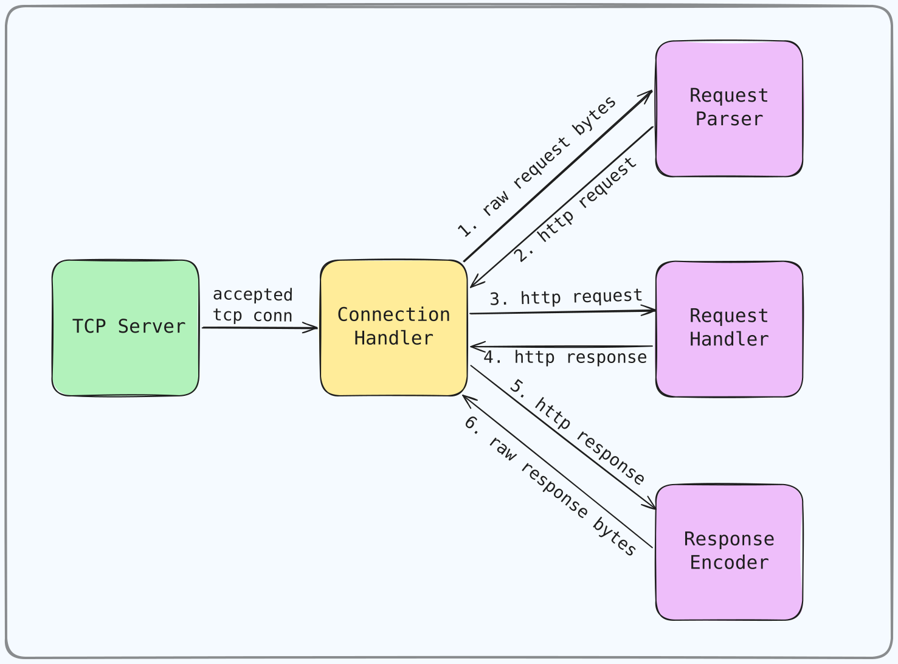

# Http Server from TCP

A minimal HttpServer, developed in order to dive deeper into HTTP protocol, and deal with the challenges of the process of handling request/response cycle practically, and get a better understanding of how does web/http servers and Backend/API frameworks work internally.

**NOTE :** This HttpServer is not even close to real-world web serves, and it doesn't support many of advanced HTTP features! (Generally I developed this project just for educational purposes! 🙃)

### content

- [Overview of Features](#overview-of-features)
- [Directory Layout](#directory-layout)
- [How It Works (Server Architecture and Work Cycle)](#how-it-works-server-architecture-and-work-cycle)
- [Setup and Test](#setup-and-test)

<br>

## Overview of Features

- Graceful shutdown handling
- Concurrent connections handling (one goroutine for each TCP connection)
- Parsing raw bytes (coming from TCP connection) to meaningful HTTP request
- Handling parsed HTTP requests and using its headers to direct server's behavior; for example:
    - managing response body compression, using `Accept-Encoding` header
    - managing decompression for possibly compressed request bodies, using `Content-Encoding` and `Transfer-Encoding` headers
    - handling **keep-alive** behavior using `Keep-Alive` header, request `HTTP Version`, and `Content-Length` header (reading incoming bytes as much as ***Content-Length Value***, then stop and wait for next incoming request bytes, **to prevent EOF** and force closing connection)

<br>

## Directory Layout

```sh
.
├── cmd/main.go          # server bootstrap and run
├── config/config.go     # configuration initialization
├── logging/logger.go    # logger setup
│
├── http/                # http components implementation (Request, Response, Header, ...)
│
├── server
│   ├── compression.go   # Compression & Decompression utils
│   ├── conn_handler.go  # Connection Handler: handle tcp connections & request/response cycles
│   ├── req_handler.go   # Request Handler: handle parsed request & prepare response
│   ├── req_parser.go    # Request Parser: parse incoming raw bytes into http request
│   ├── resp_encoder.go  # Response Encoder: encode a response object to raw bytes
│   └── server.go        # main server implementation (based on TCP listener)
│
├── tests/               # tests and testing helpers
└── ...
```

<br>

## How It Works (Server Architecture and Work Cycle)

### Main Work Cycle

<p>
  
</p>

**TCP Server:** After accepting each connection, spawns a goroutine of `Connection Handler` to handle that connection

**Connection Handler:**

1. Parse raw request bytes into meaningful HTTP request using `Request Parser`
2. Handle parsed HTTP request to generate proper HTTP response using `Request Handler`
3. Encode generated HTTP response to raw bytes using `Response Encoder`
4. Send encoded response bytes to TCP connection
5. **Keep alive connection** and wait for the next incoming request bytes (and go to step 1) / or **Close connection**

<br>

## Setup and Test

First clone the repository:

```bash
git clone https://github.com/hamidgh01/HttpServer-from-TCP.git
```

or [download the zip file](https://github.com/hamidgh01/HttpServer-from-TCP/archive/refs/heads/main.zip), and unzip

### Docker Setup

Requirements: **Docker**

Build image:

```bash
cd HttpServer-from-TCP
docker build -t httpserver:0.1.0 .
```

**Base Images:** `golang:1.27-alpine` for build, and `alpine:3` for runtime

Run a container from built image:

```bash
docker run -d -p 8000:8000 --name my-httpserver httpserver:0.1.0
# or
docker run -d -P --name my-httpserver httpserver:0.1.0
docker port my-httpserver  # to check port mapping
```

### Local Setup

Requirements: **Go Language**

There is'nt any dependency and env/configuration setup for this project!

Just go to project's root directory and run the server:

```bash
cd HttpServer-from-TCP

go run ./cmd
# or
go build -o httpserver ./cmd/main.go
./httpserver
```

But you can change default configurations using CLI flags. use `-help` flag to see options:

```bash
go run ./cmd -help
./httpserver -help
```

### Test HTTP-Server Manually:‍‍

```bash
curl -v http://localhost:8000
curl -v http://127.0.0.1:8000
curl -v http://127.0.0.1:8000/home
curl -v http://127.0.0.1:8000/optional/path
```

Or, just open your browser and enter:

```text
http://localhost:8000
http://127.0.0.1:8000
http://127.0.0.1:8000/home
http://127.0.0.1:8000/optional/path
```

<br>

## License

This project is licensed under the **MIT License**. See the [LICENSE File](./LICENSE) for more details.

<br>

**Developed by [hamidgh01](https://github.com/hamidgh01)**
